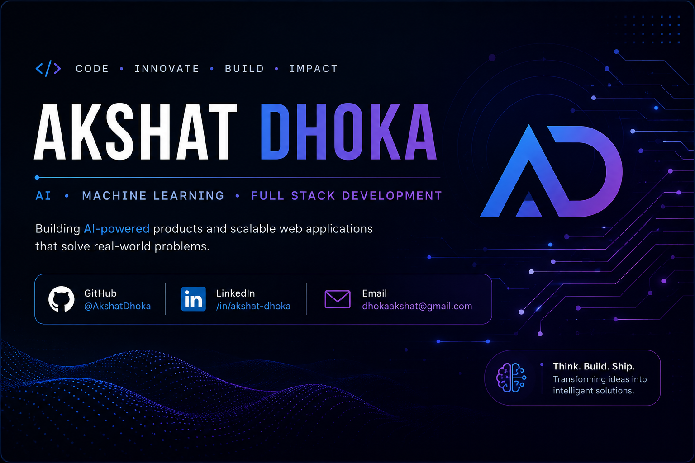

  

# Hi 👋, I'm Akshat Dhoka

### AI • Machine Learning • Full Stack Developer

**Building AI-powered products and scalable web applications that solve real-world problems.**

---

# 👨‍💻 About Me

I'm **Akshat Dhoka**, a **B.Tech Information Technology** student at **SVKM NMIMS – Mukesh Patel School of Technology, Management & Engineering (MPSTME)**.

I enjoy building **AI-powered products**, **full-stack web applications**, and solving real-world problems through technology.

Currently, I'm focused on expanding my expertise in **Artificial Intelligence, Machine Learning, System Design, and scalable backend development**, while continuously building production-ready projects.

My long-term goal is to become a **Software Engineer specializing in AI and Full Stack Development**, creating products that deliver meaningful impact at scale.

---
# 🚀 Current Focus

- 🤖 Building **Shifra AI** – An AI-powered developer assistant.
- 📚 Learning **LLMs, RAG, and Agentic AI**.
- 🌐 Mastering **Next.js, TypeScript, Full Stack Development, AI and ML**.
- 🧠 Practicing **Data Structures & Algorithms**.
- 🚀 Preparing for **Software Engineering internships**.

- # 💻 Tech Stack

### 👨‍💻 Languages

### 🎨 Frontend

### ⚙️ Backend

### 🗄️ Database

### 🛠️ Tools

